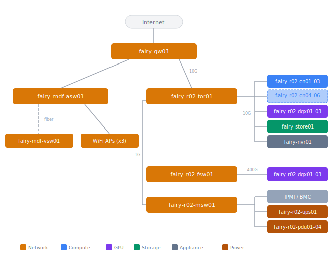

# Fairy Network Topology

The fairy site uses 10GBase-T for compute and home network traffic, a dedicated
400G QSFP-DD fabric for GPU interconnect, and a separate 1G management network.

## IP Addressing

### Site Network

The network is flat — all devices share a single subnet. A separate guest
network runs on VLAN 900 with its own subnet.

| Setting | Value |
|---------|-------|
| Subnet | 192.168.227.0/24 |
| Gateway | 192.168.227.1 |
| Guest VLAN | 900 |
| Compute nodes | 192.168.227.16–21 |

### Pod and Service Networks

| Network | CIDR |
|---------|------|
| Pod IPv4 | 10.230.0.0/16 |
| Pod IPv6 | fd2b:ec92:e232::/48 |
| Service IPv4 | 10.229.0.0/16 |
| Service IPv6 | fd2b:ec92:e230:1::/112 |
| Cluster DNS (IPv4) | 10.229.0.10 |
| Cluster DNS (IPv6) | fd2b:ec92:e230:1::a |

### DNS

DNS is managed entirely by gw01 (Firewalla). All clients on the network use
the Firewalla as their resolver.
