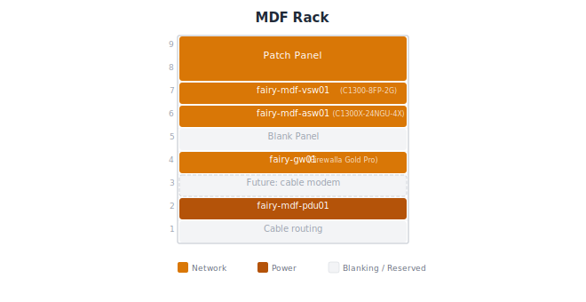
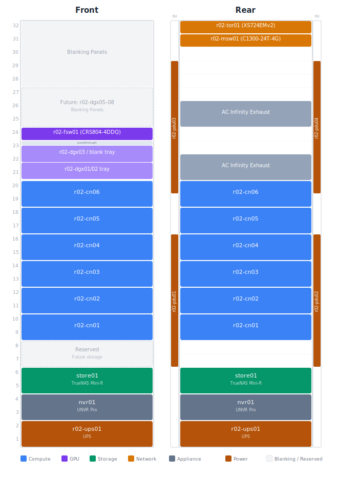

# Fairy Site

Fairy is the primary homelab site - with a 32U compute rack and a
wall-mounted MDF rack. It runs a single Kubernetes cluster (fairy-k8s01) across
custom-built AMD64 [Freckle compute nodes](../../compute/freckle-compute-nodes.md)
and three [NVIDIA DGX Spark](../../compute/dgx-spark.md) ARM64 GPU nodes, all on
Talos Linux. The compute nodes handle everything from home automation and media
services to monitoring and storage controllers, while the DGX Sparks run LLM
inference via vLLM. Storage is split between Ceph (distributed across the compute
nodes' NVMe OSDs) for Kubernetes workloads and a
[TrueNAS Mini-R](../../storage/truenas-store01.md) for bulk media.

The network is flat on a single /24 with a
Firewalla Gold Pro as the router, a 10G
top-of-rack switch for all node traffic, and a 400G fabric switch for GPU-to-GPU
communication. See [Fairy Network Topology](../../networking/fairy-network.md)
for the full picture.

## MDF

The main distribution frame rack sits behind the server rack and houses the
router, switches, and home network management.

### Rack Layout

[Tecmojo 9U Wall Mount Rack](https://www.amazon.com/dp/B0CCJ9ZZKL) (white,
glass front door).

### Hardware

#### Networking

| Device | Model | Role |
|--------|-------|------|
| gw01 | Firewalla Gold Pro | Router/firewall, [AT&T 802.1X bypass](../../guides/att-802.1x-bypass.md) |
| mdf-asw01 | Cisco C1300X-24NGU-4X | Home network switch |
| mdf-vsw01 | Cisco C1300-8FP-2G | PoE switch for outdoor endpoints (surge isolation) |
| WiFi APs (x3) | Firewalla AP7 | WiFi 7, ceiling-mount |

The outdoor PoE switch (mdf-vsw01) is intentionally separate from the home
network to provide lightning/surge isolation for outdoor camera and AP cable
runs. It connects back to mdf-asw01 via fiber to maintain electrical isolation.

#### Power

| Device | Model | Notes |
|--------|-------|-------|
| mdf-pdu01 | CyberPower PDU81005 | Not network-connected |

## r02

The compute rack houses all Kubernetes nodes, storage, and the 10G/400G network
fabric for the fairy-k8s01 cluster.

### Rack Layout

[StarTech 32U 4-Post Server Rack Cabinet](https://www.amazon.com/dp/B099986PZF)
(RK3236BKF) with adjustable mounting depth and glass front / mesh rear doors.

The DGX Spark units are mounted in
[Racknex UM-NVI-202](https://racknex.com/nvidia-dgx-spark-rack-mount-kit-um-nvi-202/)
rack mount kits. Each tray holds two units and occupies ~1.33U.

### Hardware

#### Networking

| Device | Model | Role |
|--------|-------|------|
| r02-tor01 | Netgear XS724EMv2 | Top-of-rack switch (24x 10GBase-T, 4x 10G SFP+) |
| r02-fsw01 | MikroTik CRS804-4DDQ | GPU fabric switch (4x 400G QSFP-DD) |
| r02-msw01 | Cisco Catalyst C1300-24T-4G | Out-of-band management (IPMI, JetKVM, PDU, vPro) |

See [Fairy Network Topology](../../networking/fairy-network.md) for port
allocations and IP addressing.

#### Compute

| Device | IP | Role | Type |
|--------|----|------|------|
| r02-cn01 | 192.168.227.16 | Control plane | [Freckle Gen 3.0](../../compute/freckle-compute-nodes.md#gen-30) |
| r02-cn02 | 192.168.227.17 | Control plane | [Freckle Gen 3.0](../../compute/freckle-compute-nodes.md#gen-30) |
| r02-cn03 | 192.168.227.18 | Control plane | [Freckle Gen 3.0](../../compute/freckle-compute-nodes.md#gen-30) |
| r02-cn04 | TBD | Worker (planned) | [Freckle Gen 3.1](../../compute/freckle-compute-nodes.md#gen-31-changes) |
| r02-cn05 | TBD | Worker (planned) | [Freckle Gen 3.1](../../compute/freckle-compute-nodes.md#gen-31-changes) |
| r02-cn06 | TBD | Worker (planned) | [Freckle Gen 3.1](../../compute/freckle-compute-nodes.md#gen-31-changes) |
| r02-dgx01 | 192.168.227.19 | Worker (Inference) | [DGX Spark](../../compute/dgx-spark.md) |
| r02-dgx02 | 192.168.227.20 | Worker (Inference) | [DGX Spark](../../compute/dgx-spark.md) |
| r02-dgx03 | 192.168.227.21 | Worker (Inference) | [DGX Spark](../../compute/dgx-spark.md) |

#### Storage

| Device | Model | Notes |
|--------|-------|-------|
| store01 | [TrueNAS Mini-R](../../storage/truenas-store01.md) | 12x 26TB Exos, 2x 6-wide raidz2 |

#### Appliances

| Device | Model | Role |
|--------|-------|------|
| nvr01 | UNVR Pro | UniFi Protect NVR (7x 3.5" bays, 10G SFP+) |

#### Power

| Device | Model | Role |
|--------|-------|------|
| r02-ups01 | CyberPower PR3000RTXL2UHVACN | UPS (2U) |
| r02-pdu01–04 | CyberPower PDU81005 | 0U PDUs (mounted on rear side rails) |

## Related Pages

- [Fairy Network Topology](../../networking/fairy-network.md) — topology
  diagram and IP addressing
- [AT&T 802.1X Bypass](../../guides/att-802.1x-bypass.md) — wpa_supplicant
  on Firewalla Gold Pro
- [Firmware Upgrades](../../runbooks/firmware-upgrades.md) — DGX Spark firmware
  updates via fwupd on Talos
- [Freckle Compute Nodes](../../compute/freckle-compute-nodes.md) — Gen 3.0 and
  3.1 build specs, BOM, and design decisions
- [DGX Spark](../../compute/dgx-spark.md) — NVIDIA driver selection, GPU
  operator configuration
